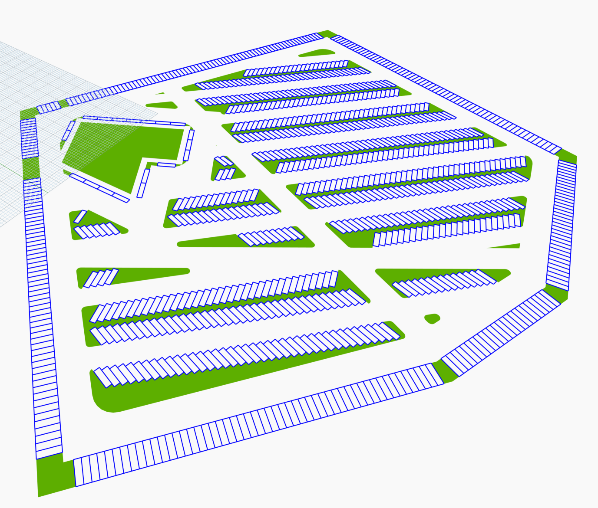

## Project Description
Feasibility aims to automate various aspects of urban and building layout design. By leveraging desktop-based platforms such as Dynamo and the web, it seeks to provide a flexible, efficient, and scalable way to design and manipulate parking layouts, erven (plot) layouts, and building massing in the future. The project encapsulates a variety of geometrical and computational operations required to create complex urban layouts, making it an invaluable tool for architects, urban planners, and civil engineers.

The Dynamo package currently contains 12 nodes, primarily built out of Dynamo out-of-the-box nodes. The nodes automate the development of surface parking with various patterns and parameters to fine-tune the parking layouts. Using the feasibility parking workflow in combination with generative design is a powerful way of producing layouts that optimally use available space. The nodes do not contain any external packages and have been tested on Dynamo v 3.3.0 and Revit 2025.4.

